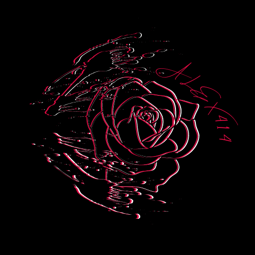

# 42Cursus
<!-- PROJECT LOGO -->
 

  <a href="https://github.com/alex414/">
<!--    
  </a>-->
  

     
    <a href="https://github.com/alex414"><strong>Perfil</strong></a>
     

<!-- TABLE OF CONTENTS -->
  <ol>
    <li>
      <a href="https://www.42madrid.com/">Sobre 42</a>
      <ul>
    <li>
      <a href="https://es.wikipedia.org/wiki/C_(lenguaje_de_programaci%C3%B3n)">C</a>
      <ul>
        <li><a href="https://github.com/alex414/42Cursus/tree/master/Libft">Libft</a></li>
        <li><a href="https://github.com/alex414/42Cursus/tree/master/Get_next_line">Get_next_line</a></li>
        <li><a href="https://github.com/alex414/42Cursus/tree/master/Ft_printf">Ft_Printf</a></li>
        <li><a href="https://github.com/alex414/42Cursus/tree/master/Minitalk">Minitalk</a></li>
        <li><a href="https://github.com/alex414/42Cursus/tree/master/Fract-ol">Fractol</a></li>
        <li><a href="https://github.com/alex414/42Cursus/tree/master/Philosophers">Philosophers</a></li>
        <li><a href="https://github.com/alex414/42Cursus/tree/master/XD">Minishell</a></li>
        <li><a href="https://github.com/alex414/42Cursus/tree/master/XD">Cpp piscine</a></li>
      </ul>
    </li>
    <li>
      <a href="https://www.docker.com/">Docker</a>
      <ul>
        <li><a href="https://github.com/alex414/42Cursus/tree/master/Ft_server">Ft_Server</a></li>
        <li><a href="https://github.com/alex414/42Cursus/tree/master/Inception">Inception</a></li>
        <li><a href="XD">Ft_Trascendence</a></li>
      </ul>
    </li>
  </ol>
